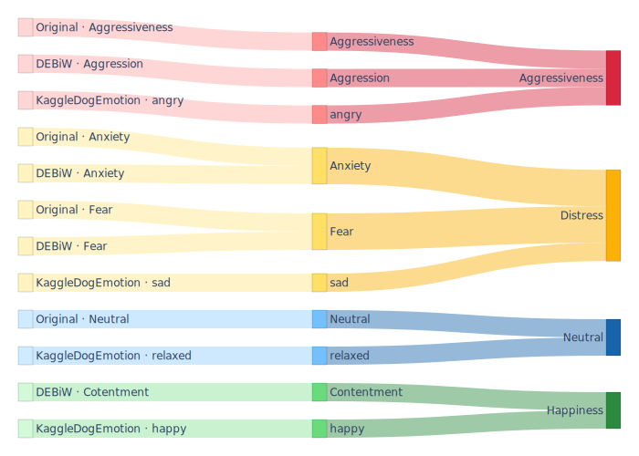

# Classification of Dogs’ Emotional Behaviour

Minimal, reproducible pipeline to train and evaluate CNN baselines for classifying dog emotional states from images, with saved curves, metrics, confusions, and EigenCAM overlays.

Note: A CUDA-capable GPU is recommended for training speed, but CPU works with smaller batches.

## Datasets

Original baseline dataset

- Access: Request from the authors of the replicated study using an institutional email. Publication DOI: 10.13053/cys-26-1-4165.
- Folder layout (ImageFolder):

```
dataset/
    Aggressiveness/
    Anxiety/
    Fear/
    Neutral/
```

DEBiW dataset

- Access: Recommended by Dr. Humberto Pérez‑Espinosa; contact Dr. Pérez‑Espinosa or the dataset authors. Reference DOI: 10.1145/3565995.3566041.
- Folder layout (ImageFolder). If you use the provided script, it writes to `DEBiW with YOLO5/` with one subfolder per label:

```
DEBiW with YOLO5/
    Aggression/
    Anxiety/
    Fear/
    Contentment/
```

If preparing manually, mirror the dataset labels as subfolders. Names can vary slightly; keep one label per folder.

Kaggle Dog Emotion dataset

- Access: Open dataset following the link https://www.kaggle.com/datasets/danielshanbalico/dog-emotion. Use per Kaggle’s terms.
- Folder layout (ImageFolder):

```
Dog Emotion Kaggle/
    angry/
    happy/
    sad/
    relaxed/
```

# Combining into one 



Use a coarse 4‑way structure (`experiments_combined_dataset/Combined4/`) that maps the above labels, following `class_merge.svg`:

```
experiments_combined_dataset/Combined4/
    Aggressiveness/
        Aggression/
        Aggressiveness/
        angry/
    Distress/
        Anxiety/
        Fear/
        Sad/
    Happiness/
        Contentment/
        happy/
    Neutral/
        Neutral/
        relaxed/
```

Adjust folder names if your original labels differ (e.g., singular/plural). The key constraint is one class per subfolder so that `ImageFolder` can read them.

## Minimal Reproduction

- Folder placement:
  - Place `dataset/` next to `PaperFullReproduction.py` (repository root).
    - Expected subfolders: `Aggressiveness/`, `Anxiety/`, `Fear/`, `Neutral/`.
  - Optional folders for other experiments (not needed for the minimal run): `DEBiW with YOLO5/`, `Dog Emotion Kaggle/` (also at repo root).
  - For the combined/coarse experiments only: place `Combined4/` inside `experiments_combined_dataset/`.

- Environment:
  - Python 3.9+
  - PyTorch and TorchVision installed per your CUDA/CPU from pytorch.org
  - Additional packages required for the minimal runs:
    - `numpy`, `scikit-learn`, `matplotlib`, `pillow`, `pytorch-grad-cam`
  - Install example:
    - `pip install numpy scikit-learn matplotlib pillow pytorch-grad-cam`
  - First run downloads pretrained weights (TorchVision) from the internet.

- Run (4-class baselines, saves into `./outputs_paperfaithful/`):
  - `python PaperFullReproduction.py`

- Run (3-class variant, merges Anxiety+Fear, saves under `./outputs_paperfaithful/3-class MobileNetV2/`):
  - `python MobileNetThreeClasses.py`

That’s all that is required to reproduce the main results.

## Configuration

- Paths are set at the top of each script:
  - 4-class and 3-class: `BASE_DIR = "./dataset"`
  - Combined/coarse: `COMBINED_ROOT = "./Combined4"` in `experiments_combined_dataset/`
- Tune `BATCH_SIZE`, `NUM_WORKERS`, `EPOCHS`, and output directories at the top of the scripts.

## Outputs

Each run writes SVG/TXT artifacts per model:
- Curves: `{ModelName}_acc_curve.svg`, `{ModelName}_loss_curve.svg`
- Confusion: `{ModelName}_conf.svg`
- Metrics: `{ModelName}_metrics.txt` (accuracy, F1, per-class P/R/F1/support/acc)
- EigenCAM overlays (per class): `{ModelName}_correct_overlays.svg`, `{ModelName}_incorrect_overlays.svg`

Examples:
- `outputs_paperfaithful/ResNet50/...`
- `outputs_paperfaithful/VGG16-OnFly/...`
- `outputs_paperfaithful/MobileNetV2/...`

## Reproducibility

- Global seeding (`set_seed(42)`) for Python/NumPy/Torch
- Seeded DataLoader workers and generators
- cuDNN determinism enabled where applicable

## Extended Experiments (optional)

If you wish to reproduce additional results (not required for the minimal run):
- Modern backbones: `experiments_models/experiment_models.py` (EfficientNetV2‑M, ConvNeXt‑Base)
- DINOv2 ViT‑S/14: `experiments_models/experiment_dinovit.py` (downloads via `torch.hub`)
- Augmentations: `experiments_augmentations/experiment_augmented.py`, `experiments_augmentations/experiment_cutmixup.py`

Additional requirement for extended experiments: `timm` (`pip install timm`). Some experiments require internet to download model weights on first use.

## License

- Code: MIT (see `LICENSE`).
- Third‑party components retain their own licenses; review before redistribution:
  - PyTorch/TorchVision: BSD‑3‑Clause
  - timm: Apache‑2.0
  - pytorch‑grad‑cam: MIT
  - YOLOv5 (optional dataset builder via `torch.hub`): AGPL‑3.0
  - DINOv2 (via `torch.hub`): see upstream repository for license

Trained weights and datasets may have additional terms (e.g., DEBiW, Kaggle). Ensure compliance with each source’s license and terms of use.

## Acknowledgements

Thanks to the authors and maintainers of PyTorch, TorchVision, Timm, DINOv2, YOLOv5, and pytorch-grad-cam.
